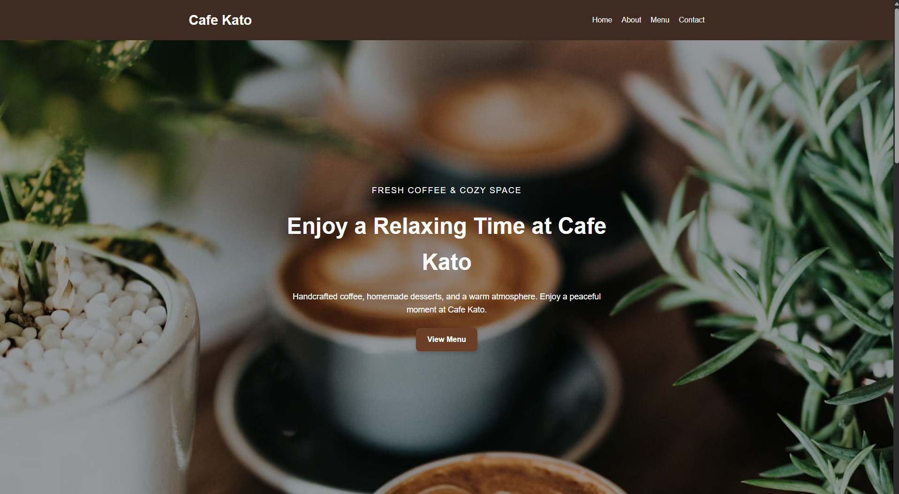
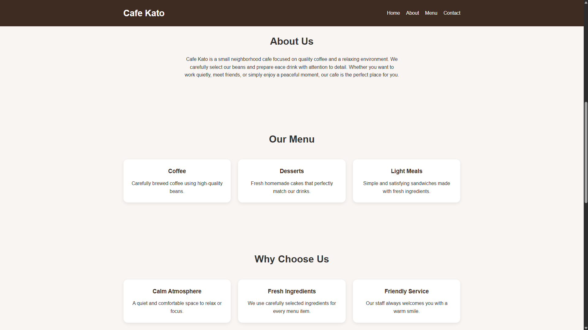
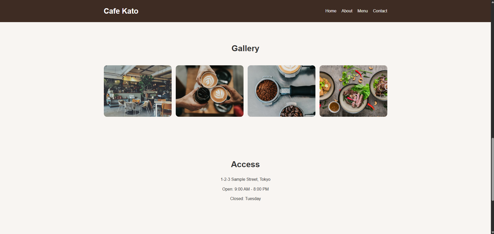

☕ Cafe Kato Landing Page

A responsive landing page for a cafe built with HTML and CSS.

🔗 Live Demo

https://kkato0219.github.io/cafe-landing-page/

📸 Screenshots

🚀 Features
Responsive design (mobile-friendly)
Clean and modern layout
Smooth scrolling navigation
Hero section with background image
Menu cards layout
Features section (Why Choose Us)
Image gallery with hover effect
Contact and access section
🛠️ Tech Stack
HTML
CSS (Flexbox & Grid)
💡 What I focused on
Building a clean and user-friendly landing page layout
Making the design responsive for different screen sizes
Creating reusable sections (cards, grid layout)
Improving UI with spacing, shadows, and hover effects